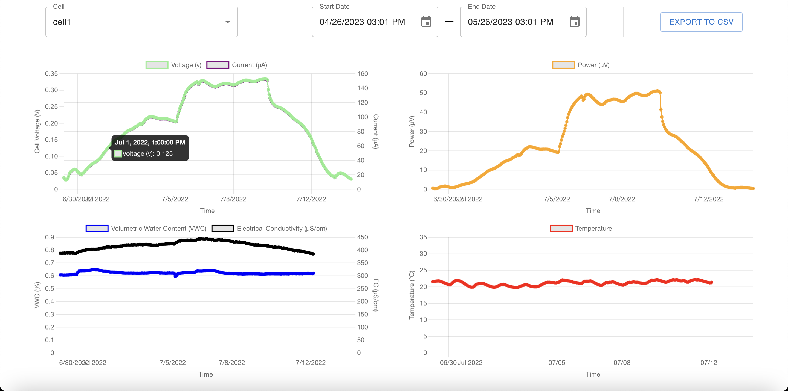

# 


[](https://codecov.io/github/jlab-sensing/ENTS-backend)

Environmental Networked Sensing (ENTS) backend is part of the ENTS hardware and software ecosystem for outdoor sensor networks. It's an open source data ingestion and visualization service that parses data from the hardware nodes and presents it in an easy-to-use web interface. Users can dynamically generate interactive plots, live monitor their sensors, or download data for offline processing. Our live version, DirtViz, is available at [https://dirtviz.jlab.ucsc.edu/](https://dirtviz.jlab.ucsc.edu/).

## Dependencies

| Dependency |
| ---------- |
| Python     |
| Node       |
| Docker     |

## Getting Started

### Starting Services

A local version of the ENTS backend can be started using `docker-compose.yml`. This will build the local images and start the required services in the background, including the database.

```console
docker compose up --build -d
```

At this point the backend is accessible at [http://localhost:3000/](http://localhost:3000/), but will likely show a blank page in your web browser and throw an error. This is due to the database being empty, therefore there is no data to display.

## Windows Development Note

When developing on Windows, be aware that Git may automatically convert line endings from LF (Unix-style) to CRLF (Windows-style). This can cause issues with shell scripts run inside Docker containers, such as `entrypoint.sh` and `migrate.sh`, resulting in errors like "entrypoint.sh not found" or "bad interpreter".

To address this, we've added a `.gitattributes` file that forces shell scripts to maintain LF line endings regardless of the operating system.

### For New Repository Clones

The `.gitattributes` file will automatically ensure proper line endings for new files.

### For Existing Repository Clones

If you encounter line ending issues with existing files:

1. Make sure you've pulled the latest changes with the `.gitattributes` file
2. Run: `git add --renormalize .`
3. Commit these changes: `git commit -m "Normalize line endings"`
4. Reset your working directory: `git checkout -- .`

Alternatively, you can also:

- Run `git config --global core.autocrlf input` to configure Git to preserve line endings
- Clone the repository again

### Generating environmental variables

The frontend and backend containers require environmental variables to be set in order to run. These are stored in a `.env` file in the root directory, which you will need to create based on the provided `.env.example` template. Copy `.env.example` to `.env` and update the values as needed.

```bash
cp .env.example .env
# Now edit .env with your own values
```

The `.env` file is used to provide the necessary environment variables to the local development containers and can be used as a base to setup environment variables for a production environment. The `.env` file should never be committed to the repository as it contains sensitive information.

> NOTE: We have run into issues with syntax of AWS ECS with the environment file. The string encapsulation characters `'` and `"` are treated as literals, while [docker supports quoting](https://docs.docker.com/compose/how-tos/environment-variables/variable-interpolation/#env-file-syntax).

#### Flask Configuration

The `CONFIG_TYPE` configures the Flask app to run in either `development` mode with value of `Development` or `production` mode with a value of `Production`. There is a `testing` mode with value of `Testing` as well, but this is used for running unit tests and should not be used in production.

#### Database (Postgres)

We use [Postgresql](https://www.postgresql.org/) as the database for the ENTS backend. The fields `DB_USER`, `DB_PASSWORD`, `DB_HOST`, and `DB_DATABASE` should be filled out with the appropriate values. The `DB_PORT` should be set to `5432` as this is the default port for Postgresql. The following SQL commands can be used to create a new database and user where `'password'` is replaced with a secure randomly generated password.

```sql
CREATE DATABASE dirtviz;
CREATE ROLE dirtviz WITH NOLOGIN PASSWORD 'password';
```

#### Public URL

The `PUBLIC_URL` is the domain alias that the website is hosted on. This is used to generate links in the website and should be set to the domain that the website is hosted on. For local development, this can be set to `http://localhost:3000/`.

#### Google

The Google API key is used to enable logins with Google accounts. Navigate to the [Google Cloud Console](https://console.cloud.google.com/) and create a new project or select the existing one associate with the website. Goto the _Google Auth Platform > Clients_ and create a new client. The client ID and secret can be found in the client details and are populated in `GOOGLE_CLIENT_ID` and `GOOGLE_CLIENT_SECRET`.

The `OAUTH_REDIRECT_URI` is the URI that Google will redirect to after a successful login. This should be set to the homepage of the hosted website, in our publically hosted instance this is set to `https://dirtviz.jlab.ucsc.edu/auth/callback`. Ensure the domain is authorized in the Google Cloud Console. For local development, this can be set to `http://localhost:3000/auth/callback`.

#### Flask Secrets

To generate a secret key for the `SECRET_KEY`, `REFRESH_TOKEN_SECRET`, and `ACCESS_TOKEN_SECRET` variables, run the following _three separate times_ in a python shell:

```
>>> import secrets
>>> secrets.token_urlsafe(16)
'LcbUf00Qnh5r-TXDNJML0g'
```

<!-- for reference OLD -->

### Migrate Database

Alembic is used to manage database migrations. Alembic is a python package and acts as a complement to sqlalchemy which is used to query the database. The following will upgrade the database to the most recent version and should be done any time the database schema changes.

> **NOTE:** It is recommended that a virtual environment is setup and **_ALL_** dependencies are installed via `pip install -r requirements.txt`. If you are unsure what this means, read [this](https://docs.python.org/3/tutorial/venv.html).

A migration script is provided in this repository that abstracts the migration process.

```bash
# To check out usage run
./migrate.sh -h
```

### Import Example Data

Real life example data is provided and can be imported with the following. The data was collected at UC Santa Cruz by jlab.

```console
python ./import_example_data.py
```

Now some graphs should appear on the website and look like the following.



## Architecture

### System

ENTS backend's client is built with React and is located under the `frontend` folder. ENTS backend's API is built with Flask and located under the `backend` folder. Check out the [frontend readme](frontend/README.md) and the [backend readme](backend/README.md) for more information.

### Local Development and Production Environments

To compile for with development configurations (eg. hot reload and logs), in `docker-compose.yml` set `target: development`. To test containers in with production configuration use `target: production`.

## Support

For bugs refer to [bug_template.md](.github/ISSUE_TEMPLATE/bug_template). For other issues, create an new issue in this repository.

For documentation on the backend, refer to [backend readme](backend/README.md)

## Contributing

To start contributing to the ENTS backend, please read [CONTRIBUTING.md](CONTRIBUTING.md)

Here's a list of [good first issues](https://github.com/jlab-sensing/DirtViz/labels/good%20first%20issue) to get yourself familiar with the ENTS backend. Comment in the issue to pick it up, and feel free to ask any questions!

## FAQ

### How do I create database migrations?

This projects makes use of [alembic](https://alembic.sqlalchemy.org/en/latest/) to handle database migrations and [flask-migrate](https://flask-migrate.readthedocs.io/en/latest/) as an extension to make alembic operations avaliable through the Flask cli. It is recommended to have a understanding of the package first before attempting to modify the database schema. Due to the way that alembic handles package imports, the config file needs to be specified while running from the root project folder. For example the following will autogenerate new migrations from the latest revision of the database.

The script migrate.sh takes in a "-m \<msg\>" for generating a new migration and by itself runs "alembic upgrade head".

> **NOTE:** Autogeneration of migrations requires a running version of the database. Refer above to see how to create and connect to a local version of the database

```bash
./migrate.sh -m "migration message here"
```

### How do I reset the local database?

Sometimes the database breaks and causes errors. Usually deleting the docker volume `postgresqldata` causing the database to be recreated fixes the issue. The following does exactly that and reapplies the migrations to the cleaned database.

```console
docker compose down
docker volume rm dirtviz_postgresqldata
docker compose up --build -d
./migrate.sh -u
```

### \[Flask-migrate\] Error: Can't locate revision identified by 'e5dbb2a59f94'

For this error, it either means that you've deleted a revision corresponding to the id located in `./backend/api/migrations/versions` or that if it's during the deployment process, the alembic version in the db (under the alembic version table) is mismatched. Double check to see if the revision history is the same for both deployment and locally.

### How do I import my own TEROS and Rocketlogger data previously collected?

There exists csv importers that can be used to populate the database. Python utilities currently exist to import RocketLogger and TEROS data. These are available as modules under the backend folder. More information on used can be found by running the modules with the `--help` flag.

```bash
python -m backend.api.database.utils.import_cell_data
```

## Maintainers

- Aaron Wu [aaron-wu1](https://github.com/aaron-wu1)

## Contributors

- John Madden [jmadden173](https://github.com/jmadden173)
- Alec Levy [aleclevy](https://github.com/aleclevy)
