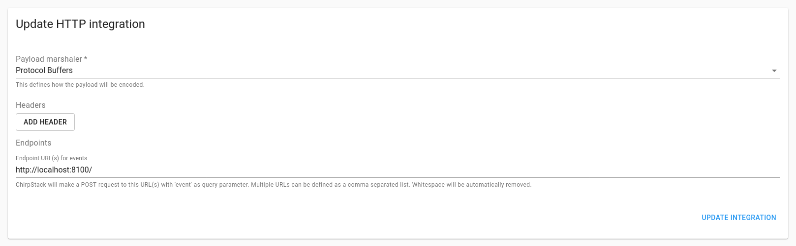

# DirtViz

DirtViz is a project to visualize data collected from sensors deployed in sensor networks. The project involves developing web based plotting scripts to create a fully-fledged DataViz tool tailored to the data collected from embedded systems sensor networks.

## Dependencies

| Dependency |
|------------|
| Python     |
| Docker     |

## Getting Started

### Starting Services

A local version of Dirtviz can be started using `docker-compose.yml`. This will build the local images and start the required services in the background, including the database.

```
docker compose up --build -d
```

At this point the portal is accessible at [http://localhost:5006/dirtviz](http://localhost:5006/dirtviz), but will likely show a blank page in your web browser and throw an error. This is due to the database being empty, therefore there is no data to display.

### Setup Connection Stings

The following table shows the default values to connect to the postgresql instance.

> **NOTE:** The database connection strings are set to static simple values as defined in `docker-compose.yml`. Do ***NOT*** use the default values for any publicly facing deployment.

| Name     | Key         | Value     |
|----------|-------------|-----------|
| User     | DB_USER     | dirtviz   |
| Password | DB_PASS     | password  |
| Hostname | DB_HOST     | localhost |
| Port     | DB_PORT     | 5432      |
| Database | DB_DATABASE | dirtviz   |

The following commands will set the necessary environment variables to allow utilities within Dirtviz to connect to the database.

```bash
export DB_USER=dirtviz
export DB_PASS=password
export DB_HOST=localhost
export DB_PORT=5432
export DB_DATABASE=dirtviz
```

### Migrate Database

Alembic is used to manage database migrations. Alembic is a python package and acts as a complement to sqlalchemy which is used to query the database. The following will upgrade the database to the most recent version and should be done any time the database schema changes.

> **NOTE:** It is recommended that a virtual environment is setup and ***ALL*** dependencies are installed via `pip install -r requirements.txt`. If you are unsure what this means, read [this](https://docs.python.org/3/tutorial/venv.html).

```bash
alembic -c dirtviz/db/alembic.ini upgrade head
```

### Import Example Data

Real life example data is provided and can be imported with the following. The data was collected at UC Santa Cruz by jlab.

```bash
python import_example_data.py
```

Now some graphs should appear on the website and look like the following.


## Integrations

Currently there are two integrations that allow for data to uploaded to the database.

### Chirpstack

Chirpstack handles data uploaded via the [LoRa](https://en.wikipedia.org/wiki/LoRa) protocol which works over extremely long ranges. The Chirpstack integration makes use of the HTTP integration that is a part of the Chirpstack software package. More information can be found at [https://www.chirpstack.io/application-server/integrations/http/](https://www.chirpstack.io/application-server/integrations/http/). Below is an example configuration within Chirpstack.



### HTTP

The HTTP integration is currently under development and will be changed significantly coming soon. Clients connected over Ethernet can send HTTP POST request to `http://localhost:8090` in CSV format. See the source code for formatting.


## FAQ

### How do I create database migrations?

This projects makes use of [alembic](https://alembic.sqlalchemy.org/en/latest/) to handle database migrations. It is recommended to have a understanding of the package first before attempting to modify the database schema. Due to the way that alembic handles package imports, the config file needs to be specified while running from the root project folder. For example the following will autogenerate new migrations from the latest revision of the database.

> **NOTE:** Autogeneration of migrations requires a running version of the database. Refer above to see how to create and connect to a local version of the database

```bash
# Migrate to latest version
alembic -c dirtviz/db/alembic.ini upgrade head
# Autogenerate migration
alembic -c dirtviz/db/alembic.ini revision --autogenerate -m "<MIGRATION MESSAGE>"
# Run generated migration
alembic -c dirtviz/db/alembic.ini upgrade head
```

### How do I reset the local database?

Sometime the database breaks and causes errors. Usually deleting the docker volume `postgresqldata` causing the database to be recreated fixes the issue. The following does exactly that and reapplies the migrations to the cleaned database.

```bash
docker compose down
docker volume rm dirtviz_postgresqldata
alembic -c dirtviz/db/alembic.ini upgrade head
docker compose up --build -d
```

### How do I import my own TEROS and Rocketlogger data previously collected?

There exists csv importers that can be used to populate the database. Python utilities currently exist to import RocketLogger and TEROS data. These are available as modules under dirtviz. More information on used can be found by running the modules with the `--help` flag.

```bash
python -m dirtviz.db.utils.import_rl_csv
python -m dirtviz.db.utils.import_teros_csv
```
