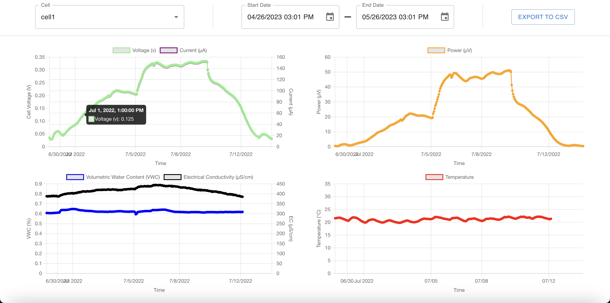

# 


[](https://codecov.io/github/jlab-sensing/ENTS-backend)

Environmental Networked Sensing (ENTS) backend is part of the ENTS hardware and software ecosystem for outdoor sensor networks. It's an open source data ingestion and visualization service that parses data from the hardware nodes and presents it in an easy-to-use web interface. Users can dynamically generate interactive plots, live monitor their sensors, or download data for offline processing. Our live version, DirtViz, is available at [https://dirtviz.jlab.ucsc.edu/](https://dirtviz.jlab.ucsc.edu/).

## Dependencies

| Dependency |
| ---------- |
| Python     |
| Node       |
| Docker     |




## Getting Started

```bash
cp .env.example .env
docker compose up --build -d
```

For developers see [docs/development.md](./docs/development.md) for how to get started and [CONTRIBUTING.md](CONTRIBUTING.md) for PR requirements.

## Support

For bugs refer to [bug_template.md](.github/ISSUE_TEMPLATE/bug_template). For other issues, create an new issue in this repository.

For documentation on the backend, refer to [backend readme](backend/README.md)

## Contributing

To start contributing to the ENTS backend, please read [CONTRIBUTING.md](CONTRIBUTING.md)

Here's a list of [good first issues](https://github.com/jlab-sensing/DirtViz/labels/good%20first%20issue) to get yourself familiar with the ENTS backend. Comment in the issue to pick it up, and feel free to ask any questions!

To keep in communication, we use [Zulip](https://ents.zulipchat.com/)! Feel free to join and ask questions.

## FAQ

### How do I import my own TEROS and Rocketlogger data previously collected?

There exists csv importers that can be used to populate the database. Python utilities currently exist to import RocketLogger and TEROS data. These are available as modules under the backend folder. More information on used can be found by running the modules with the `--help` flag.

```bash
python -m backend.api.database.utils.import_cell_data
```

## Maintainers

- Alec Levy [aleclevy](https://github.com/aleclevy)

## Contributors

- Aaron Wu [aaron-wu1](https://github.com/aaron-wu1)
- John Madden [jmadden173](https://github.com/jmadden173)
