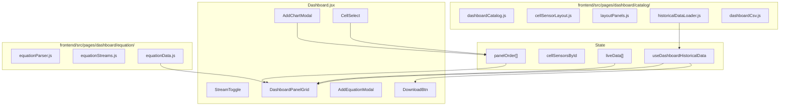

# DirtViz Dashboard — Developer Guide

Technical reference for the catalog-driven dashboard layout, derived equations, centralized historical loading, live streaming, CSV export, chart deduplication, and cell-change auto-add work from 2026 (PRs #770, #780, #797, #805, #815, #816, #819, and related fixes).

For architecture context, see the sections below.

---

## High-level architecture



**Data flow (Hourly):** `Dashboard.jsx` → `useDashboardHistoricalData` → `historicalDataLoader.js` → `/api/power`, `/api/teros`, `/api/sensor` → central cache → `PowerCharts` / `TerosCharts` / `UnifiedChart` / `DerivedEquationChart`.

**Data flow (Live):** Flask-SocketIO emits `measurement_received` → `Dashboard.jsx` buffers `liveData` → `processLiveData` → chart components and `buildDerivedSeriesFromLiveData`.

---

## Panel model and URL layout

### Panel IDs

| Kind | ID pattern | Example | Rendered by |
|------|------------|---------|-------------|
| Builtin | fixed string | `power-vi`, `power-p`, `teros`, `temp` | `PowerCharts`, `TerosCharts` |
| Unified catalog | `u:{type}` | `u:co2`, `u:soilPot` | `UnifiedChart` with `type` |
| DB sensor | `s:{sensorId}` | `s:2029` | `UnifiedChart` with `sensorSpec` from cell sensors |
| Derived equation | expression string | `407:vwc / 407:temp` | `DerivedEquationChart` |

Definitions: `frontend/src/pages/dashboard/catalog/dashboardCatalog.js`  
URL parse/serialize: `frontend/src/pages/dashboard/catalog/layoutPanels.js`

### Layout query param

- Serialized as `layout=v1:{token},{token},...`
- Short tokens map via `LAYOUT_NAME_TO_PANEL_ID` (`vi` → `power-vi`, `vwc` → `teros`, `co2` → `u:co2`)
- Derived expressions pass through unchanged when they parse as valid equations
- `parseLayoutParam` / `serializeLayoutParam` round-trip panel order

### Drag-and-drop

- `@dnd-kit/core` + `@dnd-kit/sortable` in `DashboardPanelGrid.jsx`
- Each panel wrapped in `SortableChartPanel.jsx` (hover-revealed ≡ handle, × remove, edit for equations)
- Reorder updates `panelOrder` state → URL sync effect writes `layout`

---

## Sensor catalog and auto-discovery

### Backend

- `GET /api/catalog/sensors?cell_id={id}` — chartable series per cell (panel_id, kind, label, sensor metadata)
- `GET /api/cell/{id}/sensors` — raw sensor rows attached to a cell

### Frontend modules

**`cellSensorLayout.js`**

- `fetchCellSensorsForCells` / `fetchCatalogPanelIdsForCells` — parallel per-cell fetch
- `panelIdsFromCellSensors` — infer `s:{id}` and matching `u:*` panels from `CHART_CONFIGS`
- `defaultPanelOrderFromFetched` — default layout when no URL `layout` param
- `availablePanelIdsForCells` — union of catalog + sensor-derived ids (for mismatch warnings)
- `panelsMissingForCells` — layout entries not available for current selection

**`Dashboard.jsx` cell-change effect**

When selected cells change (`selectedCellIdsKey`):

1. Fetch sensors + catalog.
2. If **no URL layout** or **full cell swap** (`isCompleteCellSwap`) → replace `panelOrder` with `defaultPanelOrderFromFetched`.
3. If **adding cells** (`isInteractiveCellAdd`) → `mergePanelsForAddedCells` appends new panel types without discarding user order.
4. If **URL layout on initial load / partial removal** → `dedupeEquivalentPanels` only.

Helpers live in `cellSensorLayout.js`. The “previously loaded cells” ref is updated only after the winning catalog request succeeds, so a URL-sync re-render does not cancel an in-progress cell addition. Deselecting all cells clears the `layout` URL param via `applyLayoutToParams` in `dashboardCatalog.js`.

See issue [#817](https://github.com/jlab-sensing/ENTS-backend/issues/817) / PR [#819](https://github.com/jlab-sensing/ENTS-backend/pull/819).

---

## Chart deduplication (#804 / #816)

**Problem:** Catalog uses per-row `s:{sensorId}`. Adding “Soil Tension” once per cell created duplicate panels, even though `UnifiedChart` already plots all selected cells on one panel.

**Solution:** `chartIdentityForPanel(panelId, cellSensorsById)` in `cellSensorLayout.js`:

| Panel type | Identity key |
|------------|--------------|
| Builtin / unified | panel id (`u:co2`, `power-vi`, …) |
| DB sensor matching `CHART_CONFIGS` | mapped unified id (e.g. `s:12` + co2 row → `u:co2`) |
| Generic DB sensor | `sensor:{name}:{measurement}` (lowercased) |
| Equation | `eq:{expression}` |

**Consumers:**

- `dedupeEquivalentPanels` — collapse URL/default order to first panel per identity
- `handleAddPanel` in `Dashboard.jsx` — no-op if identity already present
- `AddChartModal` — hide catalog entries whose identity is already on the board (`chartIdentityForCatalogEntry`)

**Follow-up fix (`093417c`):** Generic `POWER_VOLTAGE` / `POWER_CURRENT` catalog rows must not collapse to `power-vi` when no legacy power table data exists — identity logic respects catalog vs legacy paths.

---

## Centralized historical loading

**Hook:** `frontend/src/pages/dashboard/hooks/useDashboardHistoricalData.js`

- Single fetch orchestrator gated by `panelOrder` (only loads data for visible panels)
- Split cache keys: `powerRequestKey` and `sensorRequestKey` include `resample`, date range, cells, panels, sensor metadata
- **`selectPublishedHistoricalCaches`:** charts and CSV see empty caches until both halves match the current request (fixes stale hourly data after resample change — #813)
- **`isHistoricalCacheReady`:** exported for tests

**Loader:** `historicalDataLoader.js`

- `fetchDashboardPowerTerosData`, `fetchDashboardSensorData`
- `findSensorByPanelId`, `sensorDataCacheKey(cellId, sensorName, measurement)`
- Equation ref collection via `collectEquationRefsFromPanelOrder`

**Dashboard resample:** `historicalResample` state (`none` | `hour` | `day`) passed to hook and all panel props — shared across charts and CSV.

---

## Derived equations (#780)

### Expression language

- Parser: `equationParser.js` (tokenizer + AST, `validateEquationExpression`, `evaluateEquationAt`, `extractCellStreamRefs`)
- Stream registry: `equationStreams.js` (`EQUATION_STREAMS`, `resolveStreamSpec`)
- Layout detection: valid expressions are layout entries (`isDerivedLayoutEntry`)

### Historical series

`equationData.js` → `buildDerivedSeries(expression, start, end, resample, options)`

- Resolves each `cellId:stream` ref via power/teros/sensor APIs or central cache when `useCentralCache: true`
- Aligns timestamps across refs; evaluates per timestamp
- Central cache mode does **not** fall back to network when cache empty (prevents wrong-resolution fetches)

### Live series (#805)

`buildDerivedSeriesFromLiveData(expression, liveData, options)`

- **Latest-value semantics:** each websocket packet may update one or more refs; when all refs have values, evaluate at packet timestamp
- Handles teros multi-field same packet and cross-sensor staggered packets
- Cap: `LIVE_DERIVED_MAX_POINTS` (100)

`liveValueForEquationRef(ref, measurement)` — maps websocket payload to numeric operand:

- Legacy ingest: `type === 'power' | 'teros12'`, lowercase field keys
- Generic ingest (`ents sim_generic`): `GENERIC_STREAM_TYPES` maps `POWER_VOLTAGE`, `BME280_TEMP`, etc. to stream specs + display-name data keys (from `ents` SENSOR_DATA table)

### UI

- `DerivedEquationChart.jsx` — historical via `buildDerivedSeries`, live via `buildDerivedSeriesFromLiveData`
- `AddEquationModal.jsx` — client parse + `validateEquationOnServer` before save
- Edit: pencil on sortable panel → modal in edit mode

### Backend validation

Equation validation endpoint (added in #780) checks refs against selected cell ids before persisting to layout.

---

## Live websocket (#805)

**Client (`Dashboard.jsx`):**

```javascript
const isLocalDev =
  window.location.hostname === 'localhost' || window.location.hostname === '127.0.0.1';
const socketUrl = isLocalDev ? 'http://localhost:8000' : window.location.origin;
```

- Local Vite proxies `/api` but not `/socket.io` → direct Flask on `:8000`
- Deployed builds (DirtViz, EC2 preview nginx) → same origin; nginx proxies `/socket.io/` to backend

**Server:** `backend/api/__init__.py` — `subscribe_cells` joins `cell_{id}` rooms; `util.py` emits `measurement_received` after DB insert.

**Known limitation:** socket effect depends on `[stream, processImmediateUpdate, selectedCells]` with `forceNew: true` — changing cells tears down and rebuilds the socket (packets during gap are lost).

---

## CSV export (#468 / #797 / #815)

**Implementation:** browser-only in `dashboardCsv.js` + `DownloadBtn.jsx`

- **`buildDashboardCsvExports`** — walks `panelOrder`, reads already-loaded historical caches (no new API calls)
- **One file per cell** — `triggerCsvDownload` with staggered multi-file saves (150 ms)
- Column alignment: union of timestamps across series; missing → `NAN`
- Timestamp parsing: `timestampsToMillis` uses `DateTime.fromHTTP` (RFC-1123 from Flask) with UTC fallbacks

**Resample fix (#815):**

- Export uses same `historicalResample` as charts via shared `useDashboardHistoricalData`
- `selectPublishedHistoricalCaches` prevents exporting previous downsample while refetch in flight

---

## Key files reference

| Area | Path |
|------|------|
| Dashboard shell | `frontend/src/pages/dashboard/Dashboard.jsx` |
| Panel grid + DnD | `components/DashboardPanelGrid.jsx`, `SortableChartPanel.jsx` |
| Add chart | `components/AddChartModal.jsx` |
| Add equation | `components/AddEquationModal.jsx` |
| Catalog constants | `catalog/dashboardCatalog.js` |
| Layout URL | `catalog/layoutPanels.js` |
| Cell/panel discovery | `catalog/cellSensorLayout.js` |
| Historical fetch | `catalog/historicalDataLoader.js`, `hooks/useDashboardHistoricalData.js` |
| CSV | `catalog/dashboardCsv.js`, `components/DownloadBtn.jsx` |
| Equations | `equation/equationParser.js`, `equationStreams.js`, `equationData.js` |
| Equation chart | `components/DerivedEquationChart.jsx` |
| Chart configs | `components/chartConfigs.js`, `unifiedChartUtils.js` |
| Mockup / flow | `mockups/add-chart-flow.md` (local mockups; optional) |

---

## Testing

Run from `frontend/`:

```bash
# Layout, catalog, dedupe
npx vitest run src/pages/dashboard/catalog/

# Equations + live
npx vitest run src/pages/dashboard/equation/ src/pages/dashboard/components/DerivedEquationChart.test.jsx

# Add chart modal
npx vitest run src/pages/dashboard/components/AddChartModal.test.jsx

# Full dashboard suite
npx vitest run src/pages/dashboard
```

**High-value test files:**

| File | Covers |
|------|--------|
| `cellSensorLayout.test.js` | Dedupe identity, merge on cell add, cell-swap detection, default order |
| `DashboardPanelOrder.test.jsx` | Auto-add survives URL synchronization race |
| `useDashboardHistoricalData.test.js` | Cache readiness, published cache selection |
| `equationData.test.js` | Historical + live equation evaluation, generic packets |
| `dashboardCsv.test.js` | Export columns, resample alignment |
| `layoutPanels.test.js` | URL token round-trip |
| `AddChartModal.test.js` | Catalog filtering, duplicate-type hiding |

---

## Known pitfalls

1. **`ents sim_generic` vs dashboard names** — generic upload uses `BME280_TEMP` / `Temperature`; historical queries use `bme280` / `temperature`. Live equations map generic packets; Hourly may stay empty on generic-only cells until catalog alignment is complete.

2. **Legacy vs generic power** — `power-vi` historical data comes from `/api/power/` (legacy table). Generic `POWER_VOLTAGE` rows land in sensor/data tables only.

3. **Circular import** — `dashboardCatalog.js` ↔ `layoutPanels.js` (lazy re-exports; works at runtime but fragile).

4. **Layout mismatch** — URL panels not in `availablePanelIdsForCells` trigger `LayoutMismatchNotification`; panels are filtered from fetch via `panelOrderForFetch`.

5. **Dev preview streaming** — EC2 compose upload profile streams generic format to cells 1–2; legacy-format demo stream on cell 3 (when compose upload services enabled). See `docker-compose.yml` upload profile and `.github/workflows/dev.yaml`.

---

## PR / issue map

| Change | PR | Issue |
|--------|-----|-------|
| Catalog layout, DnD, Add Chart, URL | [#770](https://github.com/jlab-sensing/ENTS-backend/pull/770) | [#675](https://github.com/jlab-sensing/ENTS-backend/issues/675) |
| Derived equation panels | [#780](https://github.com/jlab-sensing/ENTS-backend/pull/780) | — |
| Browser CSV export (per cell) | [#797](https://github.com/jlab-sensing/ENTS-backend/pull/797) | [#468](https://github.com/jlab-sensing/ENTS-backend/issues/468) |
| Live equation streaming + socket fix | [#805](https://github.com/jlab-sensing/ENTS-backend/pull/805) | — |
| CSV honors downsample | [#815](https://github.com/jlab-sensing/ENTS-backend/pull/815) | [#813](https://github.com/jlab-sensing/ENTS-backend/issues/813) |
| Chart deduplication | [#816](https://github.com/jlab-sensing/ENTS-backend/pull/816) | [#804](https://github.com/jlab-sensing/ENTS-backend/issues/804) |
| Auto-add panels on cell add / clear layout | [#819](https://github.com/jlab-sensing/ENTS-backend/pull/819) | [#817](https://github.com/jlab-sensing/ENTS-backend/issues/817) |

---

## Extending the system

**Add a new unified chart type**

1. Add entry to `UNIFIED_CATALOG` and `CHART_CONFIGS`.
2. Ensure backend catalog API returns `panel_id` for cells with that sensor.
3. Map in `CHART_TYPE_TO_PANEL_ID` (`cellSensorLayout.js`) if auto-discovery should pick it up.

**Add a new equation stream**

1. Add shorthand to `EQUATION_STREAMS` in `equationStreams.js`.
2. If live generic packets use a new `SensorType`, add row to `GENERIC_STREAM_TYPES` with correct `dataKey` from `ents` SENSOR_DATA.
3. Extend `liveValueForEquationRef` legacy branches if needed.
4. Add tests in `equationData.test.js`.

**Add CSV column for a panel type**

Extend `buildDashboardCsvExports` / helpers in `dashboardCsv.js` for the new `panelId` kind; mirror chart data source from `historicalDataLoader.js`.
